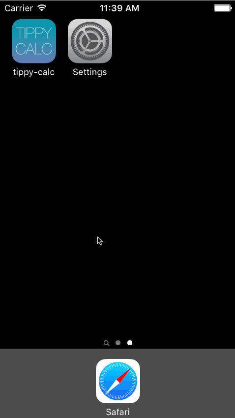

# tippy-calc


This is a tip calculator application for iOS submitted as the [pre-work](https://gist.github.com/timothy1ee/6858b706304a2397a7e2) requirement for Codepath.

Time Spent: 15 hours

Completed user stories:

* [x] Required: User can enter a bill amount, choose a tip percentage, and see the tip and total values.
* [x] Required: Settings page to change the default tip percentage.

* [x] Optional: UI animations
* [x] Optional: Remembering the bill amount across app restarts (if <10mins)
* [x] Optional: Using locale-specific currency and currency thousands separators.
* [x] Optional: Making sure the keyboard is always visible and the bill amount is always the first responder. This way the user doesn't have to tap anywhere to use this app. Just launch the app and start typing.
* [x] Optional: Add a light/dark color theme to the settings view. In viewWillAppear, update views with the correct theme colors.

* [x] Additional: Persisting tip percentage/color theme across app restarts
* [x] Additional: Bill split calculation functionality
* [x] Additional: App icon creation in assets

On `enhancements` branch: 

* [x] Enhancements: Apply autolayout, app works on different devices
  * Issue: Autolayout does not apply to Settings scene
* [x] Enhancements: Add additional view, different modal animation


### Walkthrough of all user stories
Walkthrough of required user stories and some ui animations


Walkthrough of optional and additional user stories



GIF created with [LiceCap](http://www.cockos.com/licecap/).

### Installation Instructions 

In your terminal, navigate to the folder you'd like to save the project and enter the following commands:

```
git init
git remote add origin git@github.com:aychando/tippy-calc.git
git pull origin master
open tippy-calc.xcodeproj/
```

Notes: Only works for iPhone 4" retina in portrait orientation


